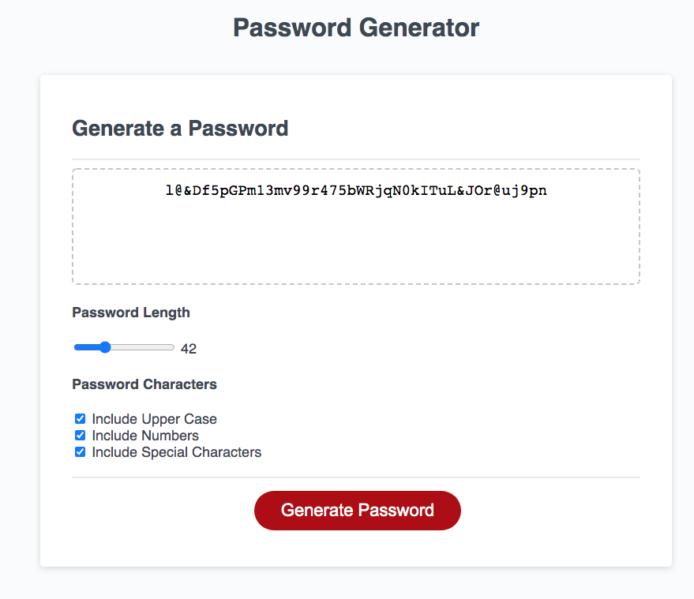

# homework_wk3
PASSWORD GENERATOR

Homework Week 3 required us to modify the supplied starter code to create an application that enabled employees to generate random passwords based on criteria that they’ve selected. This app runs in the browser and features dynamically updated HTML and CSS powered by JavaScript code.

The meet the homework requirements of selecting criteria to include in the password generator to create a password which includes based on user input upper and lower case, numeric and special characters with a length of between 8 and 128 characters, I added slider and checkbox elements.

https://jonmorg-hs.github.io/homework_wk3/